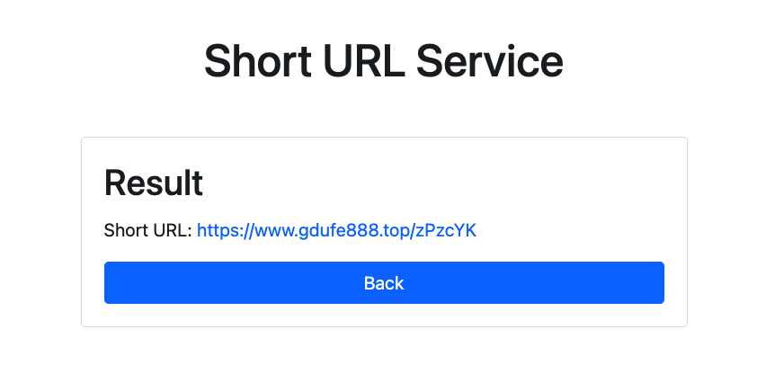

# 如何使用
1. 首先创建数据库表 [short_url.sql](src%2Fmain%2Fresources%2Fshort_url.sql)
2. git clone下项目
3. 直接使用idea打开
4. 补充mysql用户名密码[application.properties](src%2Fmain%2Fresources%2Fapplication.properties)
5. 请求ShortUrlController 生成短链，以及获取长链的接口即可

# [点我 - 体验地址](http://101.33.233.214:8999/)
前端页面完全是用GPT生成的，再次感慨GPT 人工智能的强大


 
 
 
 

# 前言
前几天面试遇到的，感觉比较有趣。第一次面试遇到考**架构设计**相关的题目，挺新奇的，开始向国外大厂靠拢了，比天天问八股文好太多了，工作5年左右的，问八股文，纯纯的不负责任偷懒行为。

感觉此问题比较有趣，这几天简单的实现了一版本，和大家分享一下具体的细节，也欢迎大家交流讨论, 代码github链接  [short-url](https://github.com/wenbochang888/short-url)。


# 短链生成的几种方法
业界实现短链的方式大概是有两种。

## 1. Hash算法
由长url通过 hash 算法，生成短的url，如果hash冲突，需要解决解决hash冲突。那么这个哈希函数该怎么取呢，相信肯定有很多人说用 MD5，SHA 等算法，其实这样做有点杀鸡用牛刀了，而且既然是加密就意味着性能上会有损失，我们其实不关心反向解密的难度，反而更关心的是哈希的运算速度和冲突概率。

能够满足这样的哈希算法有很多，这里推荐 Google 出品的 MurmurHash 算法，MurmurHash 是一种**非加密型**哈希函数，适用于一般的哈希检索操作。与其它流行的哈希函数相比，对于规律性较强的 key，MurmurHash 的随机分布特征表现更良好。非加密意味着着相比 MD5，SHA 这些函数它的性能肯定更高（实际上性能是 MD5 等加密算法的十倍以上），也正是由于它的这些优点，所以虽然它出现于 2008，但目前已经广泛应用到 Redis、MemCache、Cassandra、HBase、Lucene 等众多著名的软件中。

### 1.1 如何缩短域名
MurmurHash32会生成32位的十进制，MurmurHash64会生成64位的十进制。那我们把它转为 62 进制可缩短它的长度，为什么是62进制，不是64呢？因为62进制表示 【a-z A-Z 0-9】字符之和。
### 1.2 如何解决hash冲突
在优秀的哈希函数，都不可避免地会产生哈希冲突（尽管概率很低），该怎么解决呢。我们设计如下mysql表
```sql
CREATE TABLE `short_url` (
  `id` int(11) unsigned NOT NULL AUTO_INCREMENT,
  `lurl` varchar(150) NOT NULL,
  `surl` varchar(10) NOT NULL,
  `gmt_create` timestamp NOT NULL DEFAULT CURRENT_TIMESTAMP COMMENT '创建时间',
  PRIMARY KEY (`id`),
  UNIQUE KEY `idx_surl` (`surl`),
  KEY `idx_lurl` (`lurl`)
) ENGINE=InnoDB AUTO_INCREMENT=15536 DEFAULT CHARSET=utf8;
```
1. 获取长url，使用murmur64进行hash，并且使用Base62 encode一下，取前6位
2. 根据短链去short_url表中查找看是否存在相关记录，如果不存在，将长链与短链对应关系插入数据库中，存储。
3. 如果存在，则hash冲突了。此时在长串上拼接一个**随机字段**（注意这块优化），再次hash即可，直到没有冲突为止。

以上步骤显然是要优化的，插入一条记录居然要经过两次 sql（根据短链查记录，将长短链对应关系插入数据库中），如果在高并发下，显然会成为瓶颈。
1. 我们需要给短链字段 surl 加上唯一索引
2. 我们hash之后插入数据库，如果插入失败，说明违反了唯一性索引，此时我们重新 hash 再插入即可，看起来在违反唯一性索引的情况下是多执行了步骤，但我们要知道 MurmurHash 发生冲突的概率是非常低的，基本上不太可能发生，所以这种方案是可以接受的。
3. 如果同一个URL，频繁请求，这种会冲突多次，对此我们引入了LRU Cache，进行判断，如果在cache里面，直接返回即可，不在生成之后，再加入到cache里面

也就是整一个流程我们只和数据库有**一次交互**，同时我们引入了**LRU的缓存**，极大了提高了性能。


## 2. 发号器
维护一个自增id，比如 1，2，3 这样的整数递增 ID，当收到一个长链转短链的请求时，ID 生成器为其分配一个 ID，再将其转化为 62 进制，拼接到短链域名后面就得到了最终的短网址。但此方法需要全局维护一个自增id，同时同一个长的url会生成不同的短的url，并且短的url会有规律，比较容易猜测到。

常见的有以下几种：uuid，redis计数，Snowflake雪花算法，Mysql 自增主键。总和比较感觉雪花算法以及redis计数比较靠谱，可以尝试去使用。


# Hash函数
本次选择的hash映射方式，来生成短链。底层数据存储选择是mysql，通过mysql的分库分表，读写分离，也可以有非常高效的效率。如果采用redis，缓存会丢失数据，如果采用hbase，效率不可控，故最后选择mysql作为底层存储数据。

先说下hash函数测试的结论，比较有说服力,  可以直接看HashTest类
>  100W数据，murmur32算法(产生一个32位的hash值)，100W大概会有121个冲突
> * i = 100000(10W), conflictSize = 1
>* i = 200000(20W), conflictSize = 6
>* i = 300000(30W), conflictSize = 12
>* i = 400000(40W), conflictSize = 19
>* i = 500000(50W), conflictSize = 32
>* i = 600000(60W), conflictSize = 46
>* i = 700000(70W), conflictSize = 54
>* i = 800000(80W), conflictSize = 76
>* i = 900000(90W), conflictSize = 94
>* i = 1000000(100W), conflictSize = 121
>
> 修改为 murmur64算法，100W 0冲突，500W 0冲突，建议使用murmur64算法

# 算法实现
1. 生成url核心算法（着重看下hash冲突解决方法  && LRU的cache也需要关注）
```java
public String generateShortUrl(String longUrl) {
	if (StringUtils.isEmpty(longUrl)) {
		throw new RuntimeException("longUrl 不能为空");
	}

	String shortUrl = CacheUtils.get(MapConstants.longCache, longUrl);
	if (StringUtils.isNotEmpty(shortUrl)) {
		return shortUrl;
	}

	return getShortUrl(longUrl, getLongUrlRandom(longUrl));
}


private String getShortUrl(String rawUrl, String longUrl) {
	long hash = HashUtil.murmur64(longUrl.getBytes());
	String base62 = Base62.encode(hash + "");
	log.info("longUrl = {}, hash = {}, base62 = {}", longUrl, hash, base62);
	if (StringUtils.isEmpty(base62)) {
		throw new RuntimeException("hash 算法有误");
	}

	String shortUrl = StringUtils.substring(base62, 6);
	ShortUrl url = new ShortUrl(rawUrl, shortUrl);
	try {
		int insert = shortUrlDAO.insert(url); // 这里进行分库分表 提高性能
		if (insert == 1) {
			CacheUtils.put(MapConstants.longCache, rawUrl, shortUrl);
		}
	} catch (DuplicateKeyException  e) {
		// Hash冲突
		log.warn("hash冲突 触发唯一索引 rawUrl = {}, longUrl = {}, shortUrl = {}, e = {}", rawUrl, longUrl, shortUrl, e.getMessage(), e);
		CacheUtils.put(MapConstants.hashFailMap, rawUrl, shortUrl);
		return getShortUrl(rawUrl, getLongUrlRandom(shortUrl));
	} catch (Exception e) {
		log.error("未知错误 e = {}", e.getMessage(), e);
		throw new RuntimeException("msg = " + e.getMessage());
	}

	return shortUrl;
}


private String getLongUrlRandom(String longUrl) {
	return longUrl + RandomUtil.randomString(6);  // 解决冲突多的问题，随机字符串
}
```
2. 获取url核心算法
```java
public String getLongUrl(String shortUrl) {
	if (StringUtils.isEmpty(shortUrl)) {
		throw new RuntimeException("shortUrl 不能为空");
	}

	String longUrl = CacheUtils.get(MapConstants.shortCache, shortUrl);
	if (StringUtils.isNotEmpty(longUrl)) {
		return longUrl;
	}

	LambdaQueryWrapper<ShortUrl> wrapper = new QueryWrapper<ShortUrl>().lambda().eq(ShortUrl::getSUrl, shortUrl);
	ShortUrl url = shortUrlDAO.selectOne(wrapper);
	CacheUtils.put(MapConstants.shortCache, shortUrl, url.getLUrl());
	return url.getLUrl();
}

```

可以看到生成短链只需要访问一次数据库，获取短链也只需要访问一次数据库，是非常的快的。

# 优化点(难点、亮点)
1. 生成短链只需要访问一次数据库。而不是传统的先查询，在判断插入，而是直接插入，用唯一索引来判断是否hash冲突
2. 利用LRUCache，将最近生成的几千个kv放进map中，一段时间内，同一个长url会生成相同的短url
3. hash冲突后，给hash冲突值 加一个随机url，降低冲突概率
4. 选择比较优秀的murmur64 hash算法
5. get获取常链的时候，利用LRU识别热点数据，直接从map中读取，防止打挂数据库

# 最后
本文对短链设计方案作了详细地剖析，旨在给大家提供几种不同的短链设计思路，文中涉及到挺多的技术细节。比如murmur64 hash算法，base62，LRU，以及为什么选择mysql，而不是redis等等。文中没有展开讲，建议大家回头可以去再详细了解一下，同时也希望大家有空，可以自己动手实现一套短链服务，一定会有不小的收获。

# 其他语言
Go语言实现：[short-url-go](https://github.com/7836246/short-url-go)   感谢 [Xu Kang的贡献](https://github.com/7836246)  


# Stargazers over time
[](https://starchart.cc/wenbochang888/short-url)


当然可以！生成器模式（Builder Pattern）是一种创建型设计模式，它允许你一步一步地构建复杂对象。生成器模式将对象的构建过程与其表示分离，使得同样的构建过程可以创建不同的表示。

生成器模式的核心思想
生成器模式的核心思想是将对象的构建过程分解为多个步骤，每个步骤负责构建对象的一个部分。通过这种方式，可以灵活地创建不同的对象表示，而不需要修改构建过程。

生成器模式的组成部分
生成器模式通常包括以下几个角色：

Builder：生成器接口，定义了创建产品对象的各个部件的方法。
ConcreteBuilder：具体生成器，实现了Builder接口，构建并装配各个部件。
Director：指挥者，负责按照特定顺序调用生成器的各个部件构造方法。
Product：产品，最终构建的复杂对象。
生成器模式的优点
更好的控制：生成器模式允许你精确地控制对象的构建过程。
灵活性：可以通过不同的生成器实现创建不同的对象表示。
易于扩展：可以通过添加新的生成器来扩展对象的构建方式，而不需要修改现有代码。
生成器模式的缺点
复杂性：生成器模式会增加代码的复杂性，特别是当产品对象的部件较多时。
类的数量增加：每种产品都需要一个具体生成器类，这可能会导致类的数量增加。


